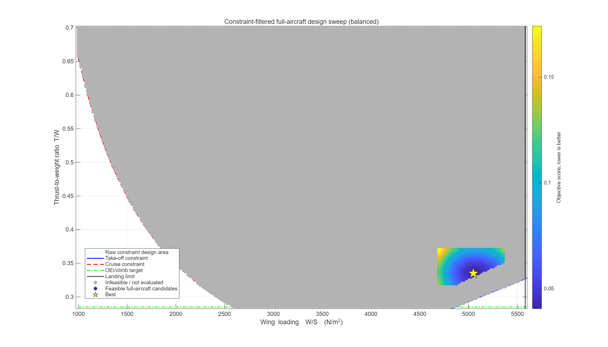
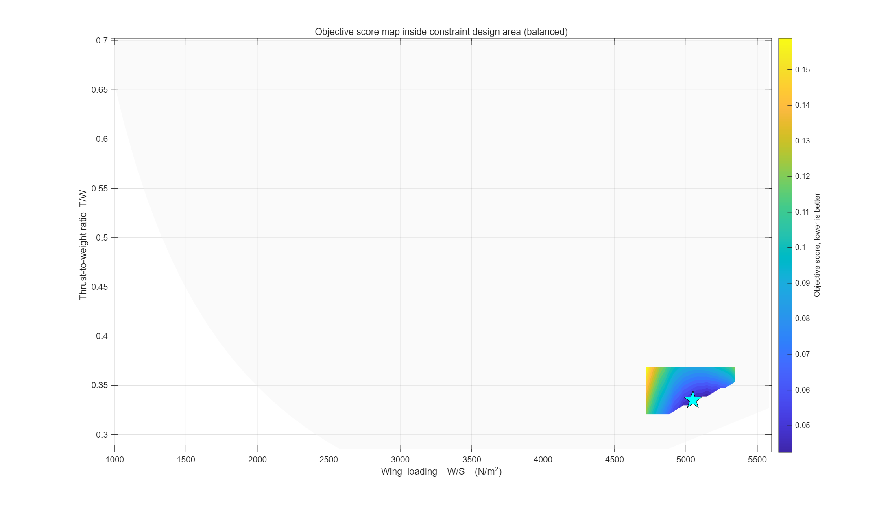
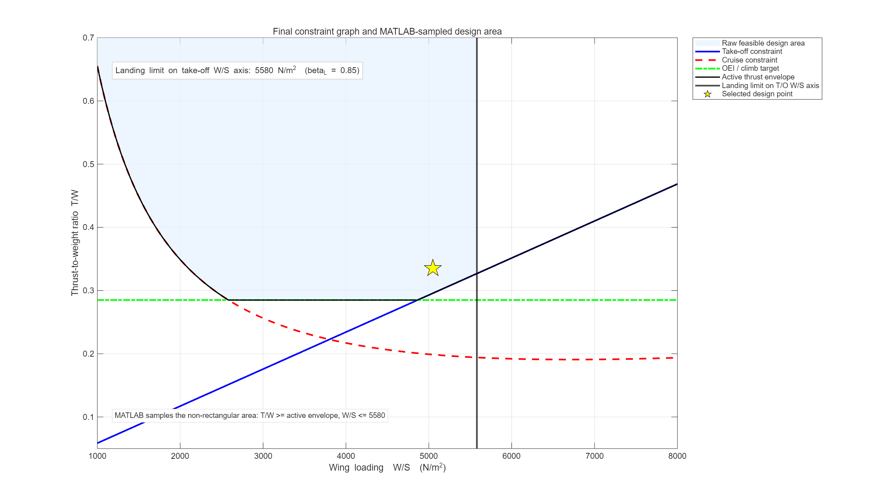

# Design Point Evaluation Methods for AERO1003 CW4

MATLAB-based conceptual aircraft design-point evaluation tool developed for **AERO1003 Coursework 4**.

This repository contains a **constraint-area sampling and full-aircraft evaluation framework** used to identify the final design point for a **186-seat medium-haul civil transport aircraft**.  
The method rebuilds the updated **\(T/W\)–\(W/S\)** constraint graph, samples feasible candidate design points, runs an aircraft-level sizing loop for each candidate, and ranks the candidates using a calibrated weighted objective score.

> This is a **preliminary conceptual-design tool**.  
> It is **not** a certification-level performance, stability, structural, or engine-performance model.

---

## Repository overview

The Coursework 4 design process required the aircraft to be re-iterated after the wing, mass, drag, tail, centre-of-gravity, and landing-gear assumptions had been updated.

The original constraint-analysis design point and the inherited aircraft geometry no longer represented the same aircraft. Therefore, a repeatable **MATLAB design-point evaluation method** was developed so that the final design point was selected systematically rather than only by visual inspection of the matching chart.

This tool answers three main questions:

1. Which \(W/S\)–\(T/W\) combinations are inside the updated feasible design area?
2. Which feasible candidates still produce realistic aircraft-level geometry, mass, CG, tail, and landing-gear results?
3. Which candidate gives the best overall preliminary aircraft-level compromise under the adopted scoring policy?

---

## Key output figures

### 1. CW2 and CW4 constraint-graph overlay

<p align="center">
  
</p>

This figure compares the **baseline CW2 constraint graph** and the **updated CW4 constraint graph**, together with the earlier CW2 design point and the MATLAB score-minimum candidate.

---

### 2. Constraint-filtered full-aircraft design sweep

<p align="center">
  
</p>

This figure shows the raw feasible region, the sampled candidate points, infeasible points, feasible full-aircraft candidates, and the current best point.

---

### 3. Objective score map inside the design area

<p align="center">
  
</p>

This figure shows how the weighted objective score varies across the feasible design area.  
Lower score is better.

---

### 4. Updated constraint graph

<p align="center">
  
</p>

This is the report-ready updated matching chart with the final feasible design area and selected point.

---

## Overall workflow

The current **v9** workflow is:

1. Rebuild the updated \(T/W\)–\(W/S\) constraint graph.
2. Define the raw feasible design area using the **landing**, **take-off**, **cruise**, and **OEI/climb** constraints.
3. Sample candidate \(W/S\)–\(T/W\) points inside the design space.
4. Reject points outside the raw constraint-graph design area before running the full-aircraft model.
5. Run the aircraft-level sizing loop for each remaining candidate.
6. Check each candidate against constraint, benchmark, and configuration rules.
7. Rank feasible candidates using the calibrated weighted objective score.
8. Export report-ready figures, CSV tables, and MATLAB result files.

---

## Constraint-graph logic

The matching chart uses take-off wing loading as the horizontal-axis variable and installed sea-level thrust-to-weight ratio as the vertical-axis variable:

$$
x=\frac{W_{TO}}{S},
\qquad
y=\frac{T_{SL}}{W_{TO}}
$$

The four updated constraint boundaries are:

1. Landing boundary  
2. Take-off boundary  
3. Cruise boundary  
4. OEI/climb boundary  

The final feasible design region is defined by the landing boundary and the active thrust envelope.

---

## Landing boundary

The landing constraint is first evaluated on the landing-weight axis and then converted onto the take-off wing-loading axis using the landing weight fraction:

$$
\left(\frac{W_{TO}}{S}\right)_L
=
\frac{1}{\beta_L}
\left(\frac{W}{S}\right)_L
$$

Current values:

```matlab
betaLanding = 0.85;
CLmaxL = 3.0;
LFL = 1500;      % m
```

This gives the take-off-axis landing boundary used in the report:

```text
W/S <= 5580.176 N/m^2
```

This is the **vertical landing line** on the matching chart.  
Candidate points must lie to the **left** of this line.

---

## Take-off boundary

The take-off boundary is calculated from the required take-off field length and the selected take-off maximum lift coefficient:

$$
\left(\frac{T}{W}\right)_{TO}
=
\frac{0.239}{S_{TO}C_{L,\max,TO}}
\left(\frac{W}{S}\right)
$$

Current values:

```matlab
TOFL = 1700;     % m
CLmaxTO = 2.4;
```

This produces a **rising straight line** on the matching chart.  
A higher wing loading requires a higher thrust-to-weight ratio to achieve the same take-off distance.

---

## Cruise boundary

The cruise boundary is based on the steady level-flight condition:

$$
T=D
$$

with the parabolic drag polar:

$$
C_D=C_{D0}+KC_L^2
$$

The installed sea-level thrust-to-weight requirement is represented as:

$$
\left(\frac{T}{W}\right)_{cr}
=
\frac{1}{\alpha_{lap}}
\left[
\frac{qC_{D0}}{W/S}
+
\frac{K(W/S)}{q}
\right]
$$

Current values:

```matlab
CD0 = 0.0175;
AR = 8.5;
e = 0.85;
K = 1/(pi*e*AR);
qCruise = 10660.9;          % N/m^2
thrustLapseCruise = 0.291;
```

The cruise curve is **U-shaped** because the parasite-drag term decreases with wing loading, while the induced-drag term increases with wing loading.

---

## OEI/climb boundary

The OEI/climb boundary is retained as a preliminary constant engine-out thrust target:

```matlab
TW_OEI = 0.285;
```

In the matching chart this appears as a horizontal line:

$$
\left(\frac{T}{W}\right)_{OEI}=0.285
$$

This value is treated as a **calibrated preliminary climb requirement**, not as a full certification-level climb-gradient calculation.

---

## Active thrust envelope

The active thrust requirement is the upper envelope of the take-off, cruise, and OEI/climb requirements:

$$
\left(\frac{T}{W}\right)_{active}
=
\max
\left[
\left(\frac{T}{W}\right)_{TO},
\left(\frac{T}{W}\right)_{cr},
\left(\frac{T}{W}\right)_{OEI}
\right]
$$

A candidate design point is inside the raw constraint-design area only if:

$$
\frac{W}{S}\leq\left(\frac{W}{S}\right)_L
$$

and

$$
\frac{T}{W}\geq\left(\frac{T}{W}\right)_{active}
$$

---

## MATLAB design-point evaluation method

After the updated constraint graph had been generated, the feasible design area contained many possible combinations of \(W/S\) and \(T/W\).  
Therefore, the final design point was **not** selected by visual inspection alone.

Instead, a group-developed MATLAB design-point evaluation method was adopted:

1. Candidate points inside the feasible design region are sampled.
2. Each candidate is rebuilt as an aircraft-level sizing case.
3. Candidates that fail the constraint, benchmark, or configuration checks are rejected.
4. The remaining feasible candidates are ranked using a weighted objective score.

This makes the design-point selection process repeatable and consistent with the aircraft-level iteration logic.

---

## Objective score

The final aircraft-level score is:

$$
J=
0.24J_{\mathrm{constraint}}
+0.24J_{\mathrm{aero}}
+0.28J_{\mathrm{benchmark}}
+0.14J_{\mathrm{configuration}}
+0.10J_{\mathrm{size}}
$$

Lower \(J\) is better.

### Score components

- **\(J_{\mathrm{constraint}}\)**  
  Penalises insufficient landing, take-off, thrust, or cruise margins.

- **\(J_{\mathrm{aero}}\)**  
  Penalises unrealistic or poor aerodynamic performance, including \(L/D\), \(C_{D0}\), and cruise \(C_L\).

- **\(J_{\mathrm{benchmark}}\)**  
  Penalises mismatch with comparable narrow-body aircraft in MTOW, span, wing area, engine thrust, and fuel mass.

- **\(J_{\mathrm{configuration}}\)**  
  Penalises poor CG, static margin, tail area ratio, landing-gear arm, and span-to-fuselage integration.

- **\(J_{\mathrm{size}}\)**  
  Penalises unnecessary growth in wing area, span, thrust, tail area, or MTOW.

The default `balanced` mode prioritises realism, constraint margin, and aerodynamic quality while still discouraging unnecessary aircraft growth.

---

## Key design result

The MATLAB sweep identifies the local score-minimum candidate near:

$$
(W/S,\;T/W)_{score\text{-}min}
=
(5050\;\mathrm{N\,m^{-2}},\;0.335)
$$

This point satisfies the hard constraint set, but it gives a slightly smaller landing margin than the intended approximate 10% margin convention.

Therefore, the final reported design point is rounded to:

$$
(W/S,\;T/W)_{final}
=
(5000\;\mathrm{N\,m^{-2}},\;0.335)
$$

At this final reported point:

- Landing margin \(\approx 10.4\%\)
- Active thrust requirement \(\approx 0.293\)
- Thrust margin \(\approx 14.4\%\)

The final reported point is therefore a slightly more conservative version of the MATLAB score-minimum candidate.

---

## Repository structure

```text
.
├── CW4_realisticConfig.m
├── run_CW4_realistic_design_sweep.m
├── run_single_design_point_realistic.m
├── run_CW4_compare_realistic_modes.m
│
├── cw4_buildConstraintGraph.m
├── cw4_queryConstraintGraph.m
├── cw4_generateConstraintAreaCandidates.m
├── cw4_plotConstraintGraph.m
├── cw4_constraintGraphTable.m
│
├── cw4_aircraftSizingLoop.m
├── cw4_evaluateCandidateRealistic.m
├── cw4_constraintChecksRealistic.m
├── cw4_scoreRealistic.m
│
├── cw4_aeroModel.m
├── cw4_massModel.m
├── cw4_wingGeometry.m
├── cw4_tailSizing.m
├── cw4_balanceModel.m
├── cw4_landingGear.m
├── cw4_propulsion.m
│
├── cw4_exportResultsRealistic.m
├── cw4_makePlotsRealistic.m
├── cw4_resultStructTemplate.m
├── cw4_forceSameFields.m
│
├── A_R.m
├── plot_constraint_graph_CW2_CW4_overlay.m
│
├── figures/
└── results_calibrated_balanced/
```

---

## Main files

| File | Purpose |
|---|---|
| `CW4_realisticConfig.m` | Central configuration file for mission requirements, constraint assumptions, aerodynamic assumptions, benchmark limits, scoring targets, and objective weights. |
| `run_CW4_realistic_design_sweep.m` | Main script for the default balanced-mode design sweep. |
| `run_single_design_point_realistic.m` | Checks one specified design point, currently \(W/S=5000\ \mathrm{N\,m^{-2}}\) and \(T/W=0.335\). |
| `run_CW4_compare_realistic_modes.m` | Compares different design philosophies: `minimum_size`, `balanced`, and `robust`. |
| `cw4_buildConstraintGraph.m` | Builds landing, take-off, cruise, OEI/climb, and active-envelope constraint curves. |
| `cw4_generateConstraintAreaCandidates.m` | Samples candidate points directly inside the non-rectangular raw constraint-design area. |
| `cw4_queryConstraintGraph.m` | Checks whether a candidate point lies inside the raw constraint area. |
| `cw4_aircraftSizingLoop.m` | Runs the feedback loop for mass, geometry, CG, tail, and gear closure. |
| `cw4_evaluateCandidateRealistic.m` | Evaluates one candidate and returns geometry, mass, performance, balance, gear, margin, and score data. |
| `cw4_scoreRealistic.m` | Computes the weighted aircraft-level objective score. |
| `cw4_exportResultsRealistic.m` | Exports CSV tables, figures, and `.mat` result files. |
| `cw4_makePlotsRealistic.m` | Generates report-ready candidate maps and objective score maps. |

---

## Quick start

### 1. Open MATLAB

Set the MATLAB current folder to the repository root.

### 2. Run the default balanced sweep

```matlab
run_CW4_realistic_design_sweep
```

This script will:

- rebuild the updated constraint graph;
- generate candidate points inside the feasible design area;
- run the aircraft-level sizing loop;
- score feasible candidates;
- export result tables and plots.

Outputs are written to:

```text
results_calibrated_balanced/
```

---

### 3. Check one design point

To check the final reported design point:

```matlab
run_single_design_point_realistic
```

By default, this checks:

```matlab
WS = 5000;     % N/m^2
TW = 0.335;    % dimensionless
```

---

### 4. Compare design philosophies

```matlab
run_CW4_compare_realistic_modes
```

This compares:

```text
minimum_size
balanced
robust
```

and writes:

```text
realistic_mode_comparison.csv
```

---

## Output files

The main sweep writes its results to:

```text
results_calibrated_balanced/
```

Typical outputs include:

| Output file | Description |
|---|---|
| `constraint_graph_balanced.png` | Report-ready updated matching chart with feasible design area and selected point. |
| `constraint_graph_curves_balanced.csv` | Numerical data for the landing, take-off, cruise, OEI/climb, and active-envelope curves. |
| `candidate_map_balanced.png` | Candidate map showing feasible, infeasible, and selected points. |
| `objective_score_map_balanced.png` | Objective score distribution inside the feasible design area. |
| `top10_normalized_outcomes_balanced.png` | Comparison of normalized outcomes for top candidates. |
| `all_candidates_balanced.csv` | Full candidate table. |
| `feasible_candidates_balanced.csv` | Feasible candidate table sorted by score. |
| `top20_candidates_balanced.csv` | Top 20 candidates from the feasible set. |
| `report_top_candidates_summary_balanced.csv` | Compact report-ready summary table. |
| `rejection_summary_balanced.csv` | Counts of candidate rejection reasons. |
| `CW4_realistic_results_balanced.mat` | MATLAB result archive containing tables, config, and constraint graph data. |

---

## Design modes

The configuration file supports three scoring philosophies:

| Mode | Purpose |
|---|---|
| `balanced` | Default mode. Balances constraint robustness, aerodynamic performance, aircraft realism, configuration quality, and size. |
| `minimum_size` | Gives stronger weight to size reduction. |
| `robust` | Gives stronger weight to constraint margins and robustness. |

The mode is selected in:

```matlab
CW4_realisticConfig(mode)
```

Example:

```matlab
p = CW4_realisticConfig('balanced');
```

---

## Current v9 update

The v9 version uses a full-scale report matching chart:

$$
W/S \text{ axis: } 1000 \text{ to } 8000\ \mathrm{N\,m^{-2}}
$$

The MATLAB candidate sampling range is still focused near the useful design region, but the plotted constraint graph shows the wider aircraft-design context.  
The sampling window is shown as a dashed box inside the full matching chart.

Candidate points are still filtered using the full constraint graph before the aircraft-level sizing loop is run.

---

## Important assumptions

This tool uses transparent preliminary-design assumptions, including:

- landing weight relief with `betaLanding = 0.85`;
- fixed high-lift targets:
  - `CLmaxTO = 2.4`;
  - `CLmaxL = 3.0`;
- fixed chart-level drag coefficient:
  - `CD0 = 0.0175`;
- aspect ratio:
  - `AR = 8.5`;
- Oswald efficiency factor:
  - `e = 0.85`;
- preliminary OEI/climb target:
  - `T/W = 0.285`;
- cruise thrust-lapse factor:
  - `alpha_lap = 0.291`;
- real-aircraft benchmark limits for a 186-seat, Mach 0.8, 3000 nm class narrow-body aircraft.

These assumptions are appropriate for a conceptual design comparison, but they should **not** be interpreted as certified aircraft performance data.

---

## Limitations

This tool does **not** perform:

- CFD or wind-tunnel aerodynamic validation;
- detailed high-lift system design;
- certification-level take-off or landing performance calculation;
- full FAR/CS-25 climb-gradient analysis;
- detailed structural sizing;
- detailed engine deck modelling;
- detailed landing-gear tyre, brake, oleo, and retraction design;
- full longitudinal, lateral, or directional stability analysis.

The selected point should therefore be described as:

> the best preliminary candidate under the stated assumptions, constraint definitions, benchmark limits, and scoring policy.

---

## Suggested report wording

The method can be described in the report as:

> A group-developed MATLAB design-point evaluation method was used after the updated constraint graph had been generated. The code sampled candidate \(W/S\)–\(T/W\) points inside the updated feasible region, rebuilt each candidate as an aircraft-level sizing case, rejected candidates that failed the constraint, benchmark, or configuration checks, and ranked the remaining candidates using a weighted objective score.

---

## Author

**Group 7**  
AERO1003 Aircraft Design Project  
Coursework 4
