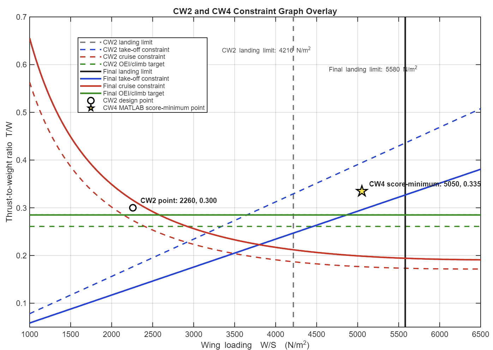
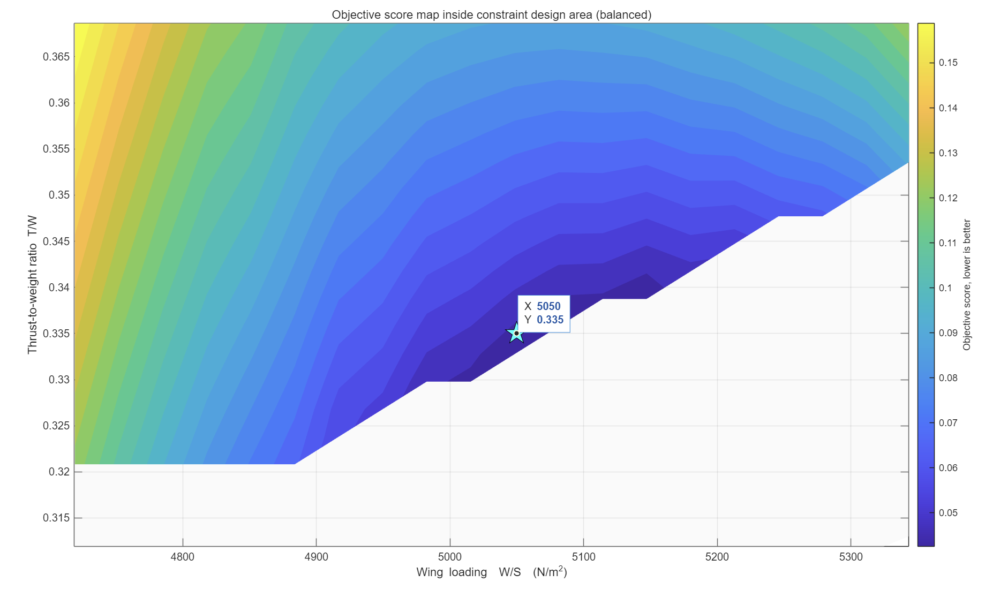

# CW4 Calibrated Constraint-Area Sampler

This repository contains a MATLAB preliminary aircraft design-point selection tool for an AERO1003 Coursework 4 style narrow-body transport aircraft study.  

The tool compares the original CW2 constraint-analysis design point with a revised CW4 design-point selection process. Instead of choosing a point from a simple rectangular search window, the code first builds the final constraint-design area, then evaluates only the candidate points that lie inside that area using a full-aircraft preliminary sizing loop.

The main selected CW4 candidate from the current run is:

| Quantity | Selected value |
|---|---:|
| Wing loading, `W/S` | `5050 N/m²` |
| Thrust-to-weight ratio, `T/W` | `0.335` |
| Objective score | `0.04056` |
| Wing area | `176.01 m²` |
| Wing span | `38.68 m` |
| MTOW | `90,606 kg` |
| Fuel mass | `21,586 kg` |
| Cruise L/D | `16.57` |
| Total thrust | `297.76 kN` |
| Thrust per engine | `148.88 kN` |

---

## What this repository is for

The repository is used to support the CW4 aircraft design-point update. It answers three practical questions:

1. **How did the CW4 design point move relative to the original CW2 point?**  
   The overlay plot compares the old CW2 constraint graph with the revised CW4 constraint graph.

2. **Which part of the `W/S`--`T/W` space is physically acceptable under the updated constraints?**  
   The design-area plot shows the region that satisfies the final landing, take-off, cruise and OEI/climb limits before the aircraft-level sizing checks are applied.

3. **Which feasible candidate gives the best balanced aircraft outcome?**  
   The objective-score map shows where the scoring function gives the lowest penalty after full-aircraft sizing, mass, balance, tail, landing-gear and benchmark checks.

This is a preliminary design tool. It is not a certification model and should not be interpreted as a final aircraft performance validation.

---

## Main result figures

### 1. CW2 and CW4 constraint graph overlay



This figure compares the original CW2 matching chart with the revised CW4 matching chart. The dashed lines represent the CW2 constraints, while the solid lines represent the final CW4 constraints. The open circle marks the original CW2 design point, and the star marks the selected CW4 MATLAB score-minimum point.

The most important message from this plot is that the final CW4 design point moved to a much higher wing loading and a slightly higher thrust-to-weight ratio. The revised landing limit is also less restrictive than the original CW2 landing limit, allowing a wider feasible region at higher `W/S`.

---

### 2. Constraint-filtered full-aircraft design sweep


This figure shows the final constraint-design area used by the MATLAB sweep. The shaded region represents the raw design area allowed by the constraint graph. Candidate points are generated inside this region and then passed into the full-aircraft sizing loop.

The grey points represent candidates that were either infeasible or rejected after the detailed checks. The coloured points represent feasible full-aircraft candidates, where the colour indicates the objective score. The star marks the best candidate found by the sweep.

This plot is important because it shows that the selected point was not chosen arbitrarily. It was selected after the constraint graph, aircraft sizing loop and realism filters had all been applied.

---

### 3. Objective score map near the selected design point



This figure zooms into the feasible candidate region and shows how the objective score changes around the selected design point. Lower score is better. The star marks the best candidate at `W/S = 5050 N/m²` and `T/W = 0.335`.

The plot shows that the selected point sits close to the lowest-score region rather than at an isolated numerical accident. This supports using it as a balanced CW4 design point, because nearby candidates have similar behaviour and the result is not overly sensitive to a single grid point.

---

## How the code works

The workflow is:

1. Build the final CW4 constraint graph.
2. Identify the raw feasible design area from the final landing, take-off, cruise and OEI/climb constraints.
3. Generate candidate `W/S`--`T/W` points only inside the constraint-design area.
4. Run a full-aircraft preliminary sizing loop for each candidate.
5. Check each candidate against aircraft-level constraints and benchmark realism limits.
6. Score the feasible candidates using a balanced objective function.
7. Export CSV tables, MATLAB result files and report-ready plots.

The key point is that the repository does not simply plot a matching chart. It connects the matching chart to a full-aircraft candidate evaluation process.

---

## Important MATLAB files

| File | Purpose |
|---|---|
| `run_CW4_realistic_design_sweep.m` | Main script for the balanced CW4 design sweep. |
| `CW4_realisticConfig.m` | Stores the mission assumptions, aircraft requirements, geometry settings, benchmark limits and scoring targets. |
| `cw4_buildConstraintGraph.m` | Creates the final CW4 constraint graph used to define the design area. |
| `cw4_generateConstraintAreaCandidates.m` | Generates candidate points inside the non-rectangular constraint-design area. |
| `cw4_runSweepRealistic.m` | Runs the candidate sweep and sends each point through the full-aircraft evaluation process. |
| `cw4_aircraftSizingLoop.m` | Iterates wing geometry, tail sizing, propulsion, aerodynamics, mass, balance and landing gear for a candidate point. |
| `cw4_constraintChecksRealistic.m` | Applies aircraft-level margins and real-aircraft benchmark filters. |
| `cw4_scoreRealistic.m` | Scores feasible candidates and identifies the best balanced design point. |
| `cw4_exportResultsRealistic.m` | Exports result tables, figures and MATLAB data files. |
| `plot_constraint_graph_CW2_CW4_overlay.m` | Produces the CW2/CW4 overlay figure. |

---

## How to run

Open MATLAB in the repository folder and run:

```matlab
run_CW4_realistic_design_sweep
```

To check one design point manually, run:

```matlab
run_single_design_point_realistic
```

To regenerate the CW2/CW4 overlay figure, run:

```matlab
plot_constraint_graph_CW2_CW4_overlay
```

---

## Main outputs

The main sweep writes results to:

```text
results_calibrated_balanced/
```

Important output files include:

| Output | Meaning |
|---|---|
| `all_candidates_balanced.csv` | Full candidate table, including feasible and rejected candidates. |
| `feasible_candidates_balanced.csv` | Candidates that passed the aircraft-level checks. |
| `top20_candidates_balanced.csv` | Best 20 feasible candidates ranked by objective score. |
| `report_top_candidates_summary_balanced.csv` | Compact report-ready summary table. |
| `rejection_summary_balanced.csv` | Summary of why candidates were rejected. |
| `CW4_realistic_results_balanced.mat` | MATLAB data file containing the sweep results. |

The GitHub README result figures are stored in:

```text
figures/figure/
```

The three README figures are:

```text
figures/figure/combined.png
figures/figure/design area.png
figures/figure/detail.png
```

---

## Important interpretation notes

- The selected point is the **best balanced candidate under the current assumptions**, not a universally optimal aircraft.
- The constraint graph defines the initial feasible design area, while the full-aircraft loop applies more detailed sizing and realism checks.
- The grey region and rejected points are useful because they show that many mathematically possible points do not produce acceptable aircraft-level outcomes.
- The objective score is used for ranking candidate designs; it should be interpreted together with the aircraft geometry, mass, thrust, aerodynamic and stability outputs.
- The result is suitable for supporting a preliminary design report, especially when explaining why the final CW4 design point differs from the earlier CW2 point.

---

## Current best candidate summary

The current best candidate is:

```text
W/S = 5050 N/m²
T/W = 0.335
```

This candidate is preferred because it remains inside the final constraint-design area, passes the aircraft-level feasibility checks, gives realistic narrow-body transport geometry and thrust levels, and lies in the low-score region of the objective-score map.

